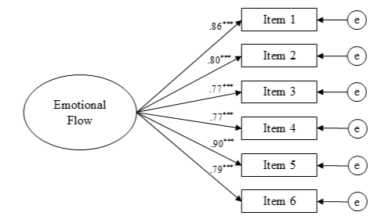

# 📈 User Engagement Metric Development & Psychometric Validation

[-blue)](https://doi.org/10.1080/15213269.2023.2215447)
[-green)](https://github.com/jfrancemone/User-Engagement-Metric-Development-and-Psychometric-Validation)
[](https://github.com/jfrancemone/User-Engagement-Metric-Development-and-Psychometric-Validation)

### **Project Overview**

Poorly designed metrics lead to noisy data. This project demonstrates **Advanced Psychometrics** and **Metric Development** by moving beyond survey design to develop a mathematically validated instrument for measuring **Dynamic User Engagement**.

Standard sentiment analysis is static (e.g., "Positive" or "Negative"). However, engagement is a process. Using **Confirmatory Factor Analysis (CFA)** and **Invariance Testing** on a sample of **2,626 users**, I developed and validated the Emotional Flow Scale, a robust KPI that measures the *trajectory* of user sentiment during content consumption.

> **📄 Publication:**
> Fitzgerald, K., Francemone, C. J., Green, M. C., Grizzard, M., & Frazer, R. (2023). The Emotional Flow Scale: Validating a measure of dynamic emotional experiences in message reception. *Media Psychology, 26*(6), 668–689.
>
> [**Read the Full Paper (PDF)**](Francemone_Scale_Development_2023.pdf)

---

### **Key Findings & Strategic Insights**

#### **1. The Process Predicts Retention**
* **The Finding:** Static enjoyment (how "fun" content was) is a weaker predictor of meaningful engagement than Emotional Flow (how much the content *moved* the user).
* **Strategic Insight:** **Metric Development.** For platforms seeking long-term user retention (e.g., Streaming, EdTech), optimizing for emotional diversity (ups and downs) yields greater positive evaluation than optimizing for pure positivity.

#### **2. Cross-Platform Scalability (Invariance Testing)**
Rigorously tested the metric to ensure it works across different content formats and user populations.
* **The Finding:** The metric demonstrated **Measurement Invariance** across text-based vs. audio-visual video content, different age groups, and genders.
* **Business Impact:** **Universal KPI.** This metric is robust enough to be deployed as a standardized engagement score across diverse product lines (e.g., News Feed vs. Video Player) and populations (e.g., Gen-X vs. Gen-Z) without needing recalibration.

#### **3. Validated Sensitivity to Content Changes**
* **The Validation:** In a controlled A/B test (Study 3), content was manipulated to have 0, 1, or 2 emotional shifts.
* **The Result:** The metric successfully detected these shifts with linear precision.
* **Application:** This tool is sensitive enough to be used in **A/B Testing** for content sequencing, allowing algorithms to optimize playlist order for maximum emotional engagement.

---

### **The Validated Instrument (Emotional Flow Scale)**
The final 6-item scale (Cronbach's α = .92) optimized for engagement tracking:
1. "I felt a range of emotions."
2. "Some of my emotions felt intense while others felt less intense."
3. "I felt a series of shifts in my emotions."
4. "I felt like I was on an emotional rollercoaster."
5. "I felt negative emotions at times, while at other times I felt positive emotions."
6. "My feelings changed a lot from the beginning to the end."

<p align="left">
  
</p>

---

### **Methodology**

* **Data Source:** N = 2,626 participants aggregated across 7 independent studies.
* **Psychometric Validation:**
    * **Exploratory Factor Analysis (EFA):** To identify the latent structure of emotional engagement from an initial 18-item pool.
    * **Confirmatory Factor Analysis (CFA):** To optimize the scale to a concise, high-reliability 6-item instrument.
    * **Invariance Testing:** To statistically prove the metric works equally well across Gender, Age, and Media Format (Text vs. Video).
* **Tools:**
    * **SPSS:** Used for initial investigation and exploratory factor analyses.
    * **AMOS:** Used for confirmatory factor analyses, structural equation modeling, and multi-group invariance testing.

---

### **Repository Structure**

```text
/User-Engagement-Metric-Development-and-Psychometric-Validation
│
├── /data
│   ├── EFS_data.csv                              <-- Complete dataset (converted to csv)
│   └── EFS_data.sav                              <-- Original dataset (SPSS format)
│
├── /baseline_model_invariance_tests              <-- Final Model (6-Item Model)
│   ├── baseline_model.amw                        <-- Path diagram & model specification (AMOS)
│   ├── baseline_model.AmosOutput                 <-- Statistical output (Chi-Square, CFI, RMSEA)
│   ├── /age                                      <-- Invariance testing: Younger vs. Older
│   ├── /sex                                      <-- Invariance testing: Male vs. Female
│   ├── /sample                                   <-- Invariance testing: Student vs. General Pop
│   └── /stimuli                                  <-- Invariance testing: Text vs. Video Content
│
├── /model_comparison_invariance_tests            <-- Robustness Checks (9-Item Model)
│   ├── 9_item_comparison_model.amw               <-- Alternative specification for fit comparison
│   ├── 9_item_comparison_model.AmosOutput        <-- Output for comparison
│   └── (Subfolders contain full invariance suite for the 9-item structure)
│
└── Francemone_Scale_Development_2023.pdf         <-- Full publication
└── factor_structure_viz.png                      <-- Model visualization
```

---

### **My Role**
**Primary Statistician & Co-Author**
* Co-led the psychometric validation strategy, including exploratory and confirmatory factor analyses.
* Managed large-scale data aggregation across 7 distinct sample populations (N=2,626).
* Conducted measurement invariance testing to ensure cross-platform and cross-population scale stability.
